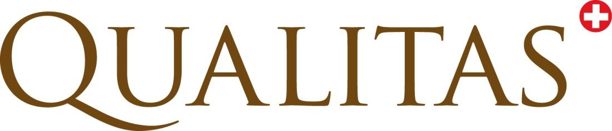

```{r setup, include=FALSE}
knitr::opts_chunk$set(echo = TRUE, results = 'asis')
```



\fcolorbox{black}{white}{
	\parbox[t]{1.0\linewidth}{
		\centering \fontsize{12pt}{20pt}\selectfont % 
		\vspace*{0.5cm} % 

		\hfill Docu -Type

		\vspace*{0.5cm} 
	}
}

\vspace*{0.5cm}

\fcolorbox{black}{white}{
	\parbox[t]{1.0\linewidth}{
		\centering \fontsize{25pt}{40pt}\selectfont %
		\vspace*{0.7cm}
    Title 1    \\
    Title 2    \\
    Title 3    \\

		\vspace*{0.7cm} % Space between the end of the title and the bottom of the grey box
	}
}

\vspace*{1cm}

\begin{center}
\includegraphics[width=0.5\textwidth]{png/Pedigree.png}
\end{center}

\vspace{5ex}
{\centering \small
\hfill
\begin{tabular}{l}
Peter von Rohr                      \\
FB EDV, Qualitas AG                 \\
\verb+http://www.qualitasag.ch+     \\
\verb+peter.vonrohr@qualitasag.ch+  
\end{tabular}
}

\pagebreak


\question{\textbf{In welchem Bereich lag bei diesem ersten Arbeitsplatz der Schwerpunkt Ihrer eigenen T?tigkeit?} 
          \emph{(Mehrfachantworten m?glich)}}

\begin{answersA}
\item \ebox{Personalwesen}
\item \ebox{Finanzplanung}
\item \ebox{Management}
\item \ebox{Forschung und Entwicklung}
\item \ebox{Lehre}
\item \ebox{Verwaltungst?tigkeit}
\item \ebox{sonstige T?tigkeiten}
\item Welche?\linetext{}
\item \longline
\end{answersA}

\line

\question{\bf F?hlen Sie sich nachts an einem der unten aufgef?hrten Orte besonders bedroht?}

\hybridbracket{\underline{Ja}, und zwar...\\
\pbox{\quad in einer Unterf?hrung}\\
\pbox{\quad im Bus}\\
\pbox{\quad in einer Tiefgarage}\\
\pbox{\quad am Bahnhof}\\
\pbox{\quad im Industriegebiet}\\
\pbox{\quad im Wald}\\
\pbox{\quad im Park}\\
\pbox{\quad am See}}
{\em Sie k?nnen mehrere K?stchen ankreuzen}
\hybridline{\underline{Ja}, an einem anderen Ort:}{Ort bitte eintragen}
\hybridclear{\pbox{\underline{Nein}, an keinem der oben\\ angef?hrten Orte}}
\hybridclear{\pbox{\underline{Nein}, weil ich nachts an den oben\\ angef?hrten Orten nie bin}}
\hybridclear{\pbox{\underline{Wei? nicht}}}

\line

\question{\bf Welchen h?chsten allgemeinbildenden Schulabschluss haben Sie?}

\begin{longanswersA}
\item \pbox{Hauptschulabschluss (bzw. Volksschulabschluss)}
\item \pbox{Realschulabschluss (Mittlere Reife)}
\item \pbox{Polytechnische Oberschule 10. Klasse}
\item \pbox{Fachhochschulreife}
\item \pbox{Allgemeine oder fachgebundene Hoschulreife/Abitur}
\item \pbox{Anderer Abschluss und zwar \linetext{Bitte tragen Sie hier den Abschluss ein}}
\item \pbox{Noch Sch?ler}
\item \pbox{Keinen Schulabschluss}
\end{longanswersA}
